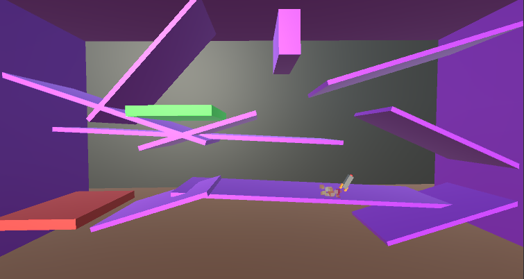
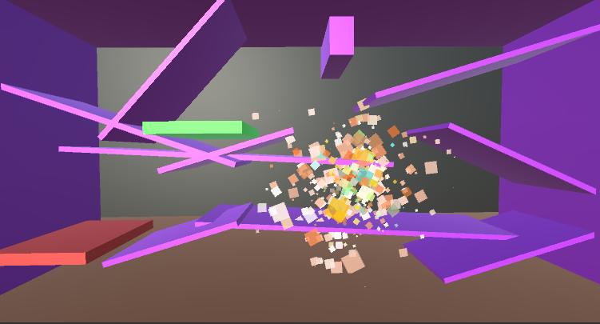
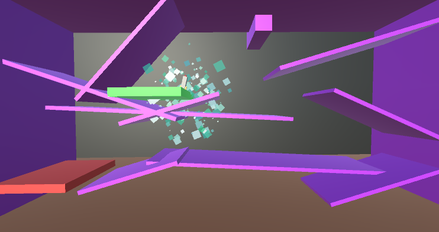
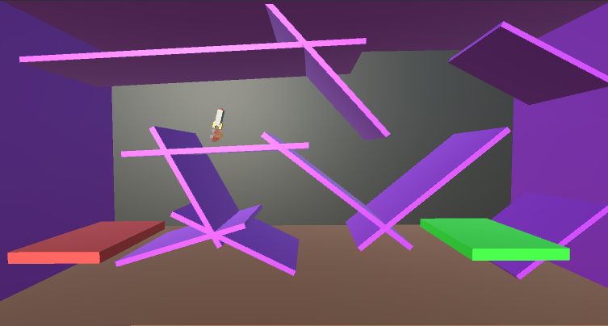

# Rocket-Game

This game is made during tutorial in "Complete C# Unity Developer 3D: Learn to Code Making Games"

The player start in a position with a rocket, then, tries to get the rocket to the green destination.

# Screenshots from the game

# First Level

# Crush Effect

# Successful Landing Effect

# Next Level

